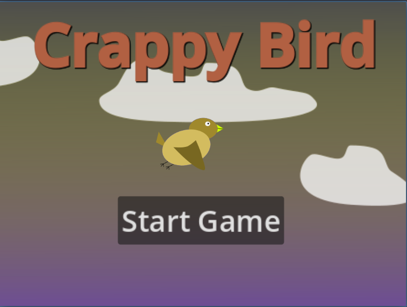

**Crappy Bird**
===============
This is an implementation of Flappy Bird, just slightly rebranding.

I've made this as part of the 20 games challenge that you can read more about here: https://20_games_challenge.gitlab.io/.

Getting it to run
-----------------
Simply download the folder and import the project into godot. Then, press F5 to run the debug build.

The game
----------
Inside the godot editor, the game can be run in debug mode. One you press "Start game", there will a short 3-second timer at which point you start controlling the bird. Pressing *up* will let the bird fly a bit higher. The game's goal is to judge pipes that block your path, each passed pipe gives one point. The game ends if you either hit a pipe or fall to the ground.

 
